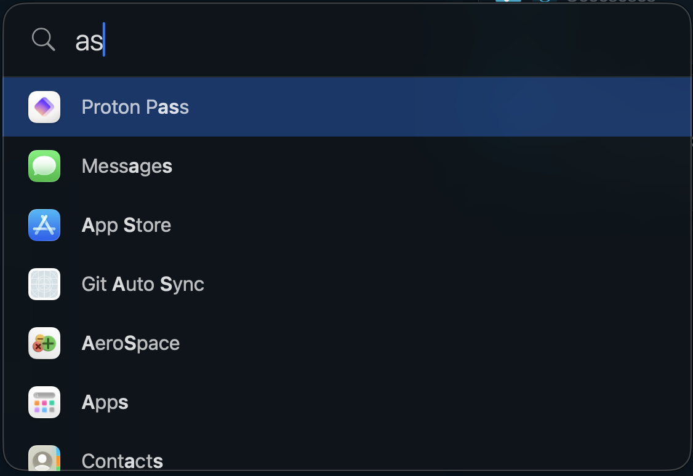

<p align="center">
  
</p>

<h1 align="center">Sift</h1>

<p align="center">A minimal Spotlight-style macOS launcher. ⌘Space to find apps, bookmarks, devices, and system controls — fast, frosted, and fully keyboard-driven.</p>



This app is fully vibe coded.

## Features

- **Fuzzy app search** — every installed app is searchable by default; opt out per-app in Settings.
- **Bookmarks** — a separate `⇧⌘Space` panel for URLs, with optional Zen browser import and a custom list you maintain in Settings.
- **Devices** — connect/disconnect paired Bluetooth devices and switch audio outputs (incl. AirPlay) from search. Optional "now connected" status strip under the search field.
- **Sleep controls** — search to enable/disable sleep via `pmset disablesleep`. A clickable yellow eye next to the search field doubles as a one-tap toggle; the menu bar icon also turns yellow when sleep is forced on. Survives external changes via a file watcher on the pmset plist.
- **Customizable global hotkeys** — rebind both `⌘Space` (launcher) and `⇧⌘Space` (bookmarks) in Settings → Shortcuts with a key recorder.
- **Panel position picker** — a 7×7 grid puts the launcher anywhere on screen.
- **Backdrop** — optional blur + dim of the rest of the desktop while Sift is open, with its own intensity slider.
- **Psychedelic mode** — opt-in backdrop animation. Picks one of **20** distinct effects at random each open: waves, plasma, aurora, starfield, matrix, tunnel, spirograph, lightning, CRT, vortex, confetti, grid floor, phyllotaxis, pixel sort, fireflies, sunburst, EKG, bouncing balls, sonar, hex cells. Independent intensity.
- **Custom menu bar popover** — clicking the menu bar icon opens a frosted SwiftUI panel (Settings, Quit) instead of a system NSMenu.
- **Launch at login** — toggleable in Settings.
- **Editorial-dark Settings UI** — single-window sidebar layout with numbered sections, serif headings, monospace eyebrow labels.

## Requirements

- macOS 14+
- Swift toolchain (Command Line Tools is enough — no full Xcode needed)
- [`just`](https://github.com/casey/just) for the task runner (or invoke the scripts in `scripts/` directly)

## Build

```bash
just build
open build/Sift.app
# or:
just run
```

All tasks run through `just`; see `just` for the full list. Recipes wrap the scripts in `scripts/`, which are also safe to invoke directly.

## First-run setup

### Free up ⌘Space

macOS uses ⌘Space for Spotlight by default. To let Sift own it, open
**System Settings → Keyboard → Keyboard Shortcuts → Spotlight** and turn off
"Show Spotlight search" (or change its shortcut). Sift shows a reminder on
first launch.

### (Optional) Sudoers rule for sleep controls

If you want Sift to toggle sleep from the launcher without a password prompt, install the sudoers rule once after building:

```bash
just sudoers
```

This drops a minimal rule into `/etc/sudoers.d/sift` that allows only
`/usr/bin/pmset disablesleep 0|1`. You'll be asked to confirm and to enter your
password once. The Settings → Sleep card shows a green check when the rule is
in place; if it's missing the card shows a one-liner you can copy and run in
Terminal.

## Usage

### Hotkeys

| Shortcut | Action |
| --- | --- |
| `⌘Space` | Toggle the launcher (configurable) |
| `⇧⌘Space` | Toggle the bookmarks panel (configurable) |
| `↑` / `↓` | Move selection |
| `Enter` | Launch app / open bookmark / connect device / switch output / toggle sleep |
| `Esc` | Dismiss |

### Search

Typing fuzzy-matches across:

- Apps (when ⌘Space is the active panel)
- Bookmarks (when ⇧⌘Space is the active panel)
- Bluetooth devices and audio outputs (when "Search devices in the launcher" is on)
- Sleep commands `Enable sleep` / `Disable sleep` (when "Search sleep controls" is on)

Result rows show their type in the trailing label (`DISCONNECT`, `SWITCH OUTPUT`, `SYSTEM`, etc.). Active devices get an accent dot and the current audio output is labelled `ACTIVE OUTPUT`.

### Status indicators

- **Connected devices strip** (toggleable) — when the search field is empty, a thin strip under it lists currently-connected BT devices and the active audio output, each with a colored dot.
- **Sleep eye** — when "Search sleep controls" is on, a small eye sits at the right of the search field: grey when sleep is enabled, yellow with a glow when sleep is disabled. Click it to toggle.
- **Menu bar icon** — the magnifying glass tints yellow when sleep is disabled (and the feature is on), matching the in-launcher eye.

### Menu bar

Click the menu bar icon for a small frosted popover with Settings / Quit. Right-click does the same.

## Settings

The settings window is organized as a sidebar with numbered sections:

1. **Apps** — fuzzy filter the full app list, toggle which are searchable.
2. **Bookmarks** — Zen browser import toggle + custom bookmarks (name + URL).
3. **Devices** — status strip toggle, search toggle (with audio-outputs sub-toggle), per-paired-BT-device opt-in list.
4. **Position** — 7×7 grid picker with a live mini-preview of the panel anchor.
5. **Shortcuts** — key recorder for launcher and bookmarks hotkeys, plus a Reset to Defaults button.
6. **General** — Launch at login, Sleep (with sudoers status + copyable install commands), Backdrop (blur/dim with intensity slider, Psychedelic toggle with its own intensity slider).

## Configuration

User preferences live at:

```
~/Library/Application Support/Sift/config.json
```

Bookmarks live alongside:

```
~/Library/Application Support/Sift/bookmarks.json
```

Both files are missing/empty by default and Sift treats that as "use defaults." Removing them resets everything.

## App icon

The icon is generated from `Resources/AppIcon.svg`:

```bash
just icon   # rebuilds Resources/Sift.icns from the SVG
```

`just build` regenerates it automatically if missing.

## Development

```bash
just test       # run SiftCore unit tests
just dev        # run unbundled (launch-at-login + sleep sudoers need the bundled .app)
just clean      # remove .build and build/ artifacts
```
