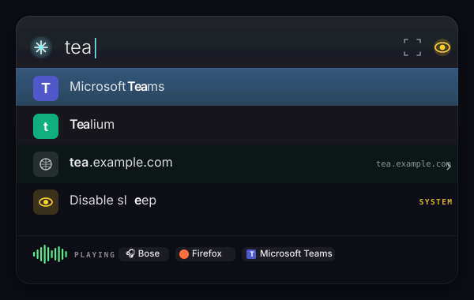
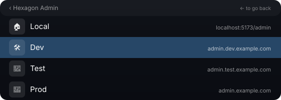

<p align="center">
  
</p>

<h1 align="center">Sift</h1>

<p align="center">A minimal Spotlight-style macOS launcher. ⌘Space to find apps, bookmarks, devices, system controls, and what's playing — fast, frosted, and fully keyboard-driven.</p>



This app is fully vibe coded.

## What it does

Sift is one panel with three things stitched together:

- A **launcher** (`⌘Space`) that fuzzy-matches your installed apps, your bookmarks, your Bluetooth devices, your audio outputs, and a handful of system commands — all in the same list.
- A **bookmarks panel** (`⇧⌘Space`) for URLs only, with optional Zen browser import and per-environment groups (Local / Dev / Test / Prod) that collapse into a single row you expand with `→`.
- A **status strip** under the search field that shows what's playing right now: a real-time audio visualizer driven by the system mix, a pill per app currently producing sound, the active output device, and the now-playing track when the source publishes one.

## Now-playing strip

When any app is producing audio, a strip appears under the search field:


- The bars on the left are an **actual audio visualizer** — a [`CATapDescription`](https://developer.apple.com/documentation/coreaudio/catapdescription) tap over all system audio processes drives the per-frame RMS+peak you're looking at. Quiet songs read low; loud ones reach the top.
- Each **source pill** is a real app currently outputting audio, with its icon and localized name. Pills update when apps start/stop playing.
- The **device pill** shows the active output (headphones, speaker, AirPlay receiver, etc.).
- When the source publishes Now Playing info (Music, Safari, Podcasts, Spotify, etc.), the song title and artist appear inline. Apps that bypass macOS's media session (Teams call audio, browsers without media-key handling) still show as a source pill — they just don't get track text.

The strip is visible idle *and* during search, anchored to the bottom of the panel.

## Environment-grouped bookmarks

If you have a Local / Dev / Test / Prod (etc.) variant of the same URL, Sift collapses them into a single row and lets you expand with `→`:



Pressing `Enter` on the row launches the default variant (Prod-ish). Pressing `→` reveals all variants with their environment icons; pick one and `Enter` to open. `⌥C` copies the highlighted URL with a brief "COPIED" badge — works both on the row and on a specific variant inside the expanded view.

## Features

- **Fuzzy app search** — every installed app is searchable by default; opt out per-app in Settings.
- **Bookmarks** — `⇧⌘Space` panel for URLs, with optional Zen browser import and a custom list you maintain in Settings. URLs that share a template (`*.dev.x.com`, `*.test.x.com`, …) automatically group into a single env-row.
- **Devices** — connect/disconnect paired Bluetooth devices and switch audio outputs (incl. AirPlay) from search.
- **Sleep controls** — search `disable sleep` / `enable sleep` (built-in commands rank above apps). A clickable yellow eye next to the search field doubles as a one-tap toggle; the menu bar icon also turns yellow when sleep is forced on.
- **Screenshot region** — built-in `screenshot` command captures a region (marquee → save to clipboard + annotate window). A small selection icon next to the search field triggers the same thing.
- **Now-playing strip** — real-time CATap audio visualizer, per-app source pills, active output device, and track/artist when published.
- **Copy bookmark URL** — `⌥C` on any bookmark row (or env-variant in the expanded view) copies the URL.
- **Smart ranking** — apps outrank bookmarks when both match; built-in commands (`sleep`, `screenshot`) outrank everything when they match. Short queries (`e`, `te`) are restricted to tight matches so the list stays short.
- **Customizable global hotkeys** — rebind both `⌘Space` (launcher) and `⇧⌘Space` (bookmarks) in Settings → Shortcuts.
- **Panel position picker** — a 7×7 grid puts the launcher anywhere on screen.
- **Backdrop** — optional blur + dim of the rest of the desktop while Sift is open, with its own intensity slider.
- **Psychedelic mode** — opt-in backdrop animation. Picks one of **20** distinct effects at random each open.
- **Custom menu bar popover** — clicking the menu bar icon opens a frosted SwiftUI panel (Settings, Quit) instead of a system NSMenu.
- **Launch at login** — toggleable in Settings.
- **Editorial-dark Settings UI** — single-window sidebar layout with numbered sections, serif headings, monospace eyebrow labels.

## Requirements

- macOS 14+ (audio visualizer needs 14.2+)
- Swift toolchain (Command Line Tools is enough — no full Xcode needed)
- [`just`](https://github.com/casey/just) for the task runner (or invoke the scripts in `scripts/` directly)

## Build

```bash
just build
open build/Sift.app
# or:
just run
```

All tasks run through `just`; see `just` for the full list. Recipes wrap the scripts in `scripts/`, which are also safe to invoke directly.

## First-run setup

### Free up ⌘Space

macOS uses ⌘Space for Spotlight by default. To let Sift own it, open **System Settings → Keyboard → Keyboard Shortcuts → Spotlight** and turn off "Show Spotlight search" (or change its shortcut). Sift shows a reminder on first launch.

### Allow system audio capture (for the visualizer)

The visualizer taps system audio output via [`CATapDescription`](https://developer.apple.com/documentation/coreaudio/catapdescription). First time you open the launcher after a fresh install, macOS asks once for permission ("Sift would like to capture system audio"). Approve it. Without it the strip shows a `waveform.slash` icon in place of the bars and source pills stop populating.

### (Optional) Sudoers rule for sleep controls

If you want Sift to toggle sleep without a password prompt, install the sudoers rule once after building:

```bash
just sudoers
```

This drops a minimal rule into `/etc/sudoers.d/sift` that allows only `/usr/bin/pmset disablesleep 0|1`. You'll be asked to confirm and enter your password once. The Settings → Sleep card shows a green check when the rule is in place.

## Usage

### Hotkeys

| Shortcut | Action |
| --- | --- |
| `⌘Space` | Toggle the launcher (configurable) |
| `⇧⌘Space` | Toggle the bookmarks panel (configurable) |
| `↑` / `↓` | Move selection |
| `→` | Expand an env-grouped bookmark into its variants |
| `←` | Collapse back to the bookmark row |
| `⌥C` | Copy the highlighted bookmark / env variant URL |
| `Enter` | Launch app / open bookmark / connect device / switch output / run command |
| `Esc` | Dismiss |

### What you can search for

Typing fuzzy-matches across everything in one list. Some examples:

- `slack` → launches Slack.app
- `disable sleep` → toggles `pmset disablesleep` (built-in command, ranks above apps)
- `screenshot` → starts a region screenshot
- `airpods` → connect/disconnect AirPods (Bluetooth)
- `bose` → switch the active audio output to Bose
- `admin` → if you have Local/Dev/Test/Prod admin bookmarks, they collapse into one row — `→` to pick

Result rows show their type in the trailing label (`DISCONNECT`, `SWITCH OUTPUT`, `SYSTEM`, `CAPTURE`, etc.). Active devices get an accent dot; the current audio output is labelled `ACTIVE OUTPUT`. Approximate matches are dropped from short queries to keep the list small.

### Status indicators

- **Now-playing strip** (toggleable) — described above; the audio visualizer, source pills, and device pill anchored to the bottom of the panel.
- **Sleep eye** — small eye at the right of the search field: grey when sleep is enabled, yellow with a glow when sleep is disabled. Click to toggle.
- **Screenshot button** — small marquee icon at the right of the search field starts a region capture.
- **Menu bar icon** — the magnifying glass tints yellow when sleep is disabled.

### Menu bar

Click the menu bar icon for a small frosted popover with Settings / Quit. Right-click does the same.

## Settings

The settings window is organized as a sidebar with numbered sections:

1. **Apps** — fuzzy filter the full app list, toggle which are searchable.
2. **Bookmarks** — Zen browser import toggle + custom bookmarks (name + URL). Combined search toggle (apps + bookmarks in the launcher panel).
3. **Devices** — now-playing strip toggle (with "hide when built-in speakers are playing" sub-toggle), search toggle (with audio-outputs sub-toggle), per-paired-BT-device opt-in list.
4. **Position** — 7×7 grid picker with a live mini-preview of the panel anchor.
5. **Shortcuts** — key recorder for launcher and bookmarks hotkeys, plus Reset to Defaults.
6. **General** — Launch at login, Sleep (with sudoers status + copyable install commands), Screenshot region toggle, Backdrop (blur/dim with intensity slider, Psychedelic toggle with its own intensity slider).

## Configuration

User preferences live at:

```
~/Library/Application Support/Sift/config.json
~/Library/Application Support/Sift/bookmarks.json
~/Library/Application Support/Sift/usage.json
```

`config.json` and `bookmarks.json` are missing/empty by default and Sift treats that as "use defaults." Removing them resets everything. `usage.json` tracks app launch counts + recency to bias ranking toward apps you actually use.

## App icon

The icon is generated from `Resources/AppIcon.svg`:

```bash
just icon   # rebuilds Resources/Sift.icns from the SVG
```

`just build` regenerates it automatically if missing.

## Development

```bash
just test       # run SiftCore unit tests
just dev        # run unbundled (launch-at-login, sleep sudoers, and the audio tap all need the bundled .app)
just clean      # remove .build and build/ artifacts
```

Debug log lands at `/tmp/sift-debug.log` (errors and one-time setup events only — quiet during normal use).
